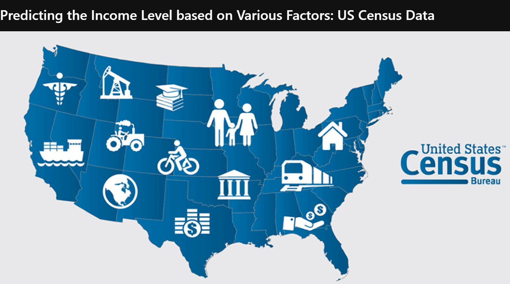

  
 

<h3><i> In 2019, a little more than 53 percent of Americans had an annual household income that was less than 75,000 U.S. dollars. The average household Income Increased for the fifth consecutive year, reaching 68,703 U.S. dollars.</h2>

 
 
 

<h2> Information:

<h3> In this project we analyze a U.S. census data taken from the UCI (University of California at Irvine) Machine Learning Repository. The project is divided into four parts: Cleaning and Preprocessing the Data, Exploratory Data Analysis, Predictive Analysis and Theoretical Background. Our final goal is to build a model, which can predict whether the income of a random adult American citizen is less or greater than 50000$ a year based on given features, such as age, education, occupation, gender, race, etc.

     
<h2> Data

<h3> Both training and test datasets are supplied along with the attribute names, have all been sourced from the UCI Machine Learning Repository (https://archive.ics.uci.edu/ml/datasets/adult). Both Datasets contain 15 variables (14 descriptive and 1 target), the dataset contains 32561 rows.

Variable descriptions are given in the table below:

    Age: continuous.

    Workclass: Private, Self-emp-not-inc, Self-emp-inc, Federal-gov, Local-gov, State-gov, Without-pay, Never-worked.

    Fnlwgt: continuous.

    Education: Bachelors, Some-college, 11th, HS-grad, Prof-school, Assoc-acdm, Assoc-voc, 9th, 7th-8th, 12th, Masters, 1st-4th, 10th, Doctorate, 5th-6th, Preschool.

    Education-num: continuous. 
    
    marital-status: Married-civ-spouse, Divorced, Never-married, Separated, Widowed, Married-spouse-absent, Married-AF-spouse.

    Occupation: Tech-support, Craft-repair, Other-service, Sales, Exec-managerial, Prof-specialty, Handlers-cleaners, Machine-op-inspct, Adm-clerical, Farming-fishing, Transport-moving, Priv-house-serv, Protective-serv, Armed-Forces.

    Relationship: Wife, Own-child, Husband, Not-in-family, Other-relative, Unmarried.

    Race: White, Asian-Pac-Islander, Amer-Indian-Eskimo, Other, Black.
    Sex: Female, Male.

    Capital-gain: continuous.

    Capital-loss: continuous.

    Hours-per-week: continuous.

    Native-country: United-States, Cambodia, England, Puerto-Rico, Canada, Germany, Outlying-US(Guam-USVI-etc), India, Japan, Greece, South, China, Cuba, Iran, Honduras, Philippines, Italy, Poland, Jamaica, Vietnam, Mexico, Portugal, Ireland, France, Dominican-Republic, Laos, Ecuador, Taiwan, Haiti, Columbia, Hungary, Guatemala, Nicaragua, Scotland, Thailand, Yugoslavia, El-Salvador, Trinadad&Tobago, Peru, Hong, Holand-Netherlands. </h3>

     

<h2> Problem Statemtent
<h3> Our final goal is to build a model, which can predict whether the income of a random adult American citizen is less or greater than 50000$ a year
     
  

### Give It a Star if you liked the project 
